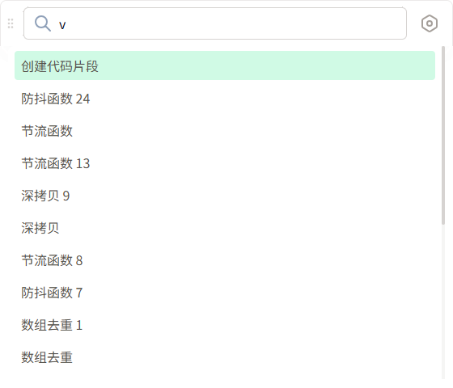
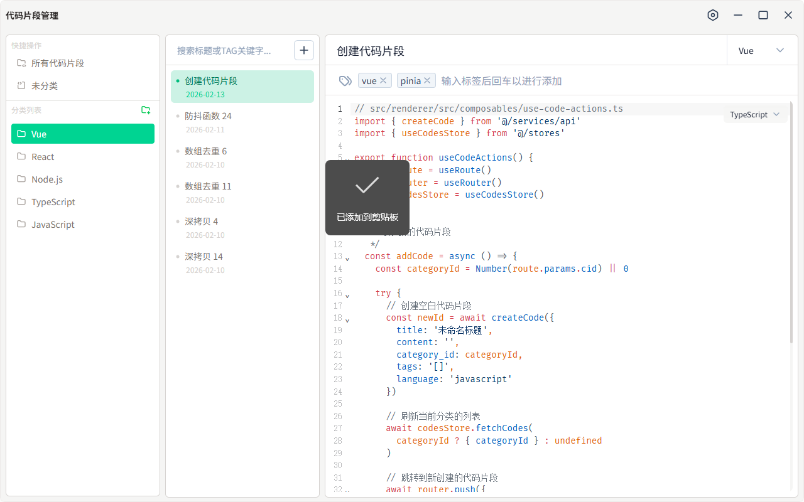
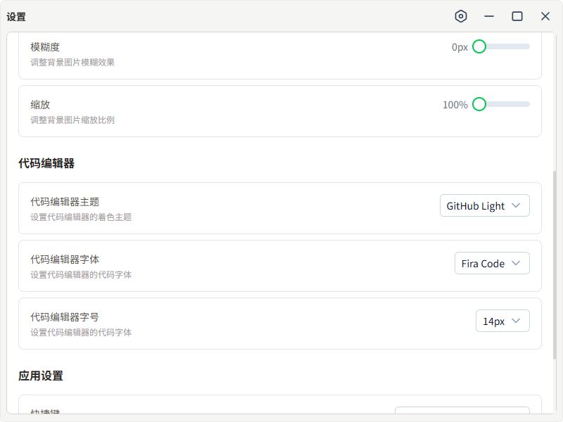

# Electron Vue Snippet App

## 介绍：

一个基于 Electron + Vue 的代码片段管理应用。

## 技术栈：

- TypeScript
- Electron 39 + Electron Vite 5 + Electron Store 8
- Vue 3.5 + Vue Router 5 + Pinia 3 + VueUse 14
- Nuxt/ui 4.4 + Tailwind Css 4.1

## 功能：

- 搜索代码片段，选中并复制到剪贴板
- 管理代码片段
  - 代码片段分类管理
    - 图标按钮添加分类
    - 右键分类菜单：重命名、删除分类
  - 代码片段管理
    - 搜索代码片段（按名称、tag）
    - 图标按钮添加代码片段
    - 右键代码片段菜单：移动分类、删除代码片段
- 代码片段应用设置
  - 主题设置
  - 主题模式（暗黑模式、浅色模式、跟随系统）
    - 应用背景色
    - 背景图片
    - 背景透明度
    - 背景模糊度
    - 背景图片缩放
  - 代码编辑器
    - 代码编辑主题: ['Dracula', 'GitHub Dark', 'GitHub Light', 'One Dark', 'Material Dark', 'Tokyo Night']
    - 代码编辑器字体: ['Fira Code', 'JetBrains Mono', 'Source Code Pro']
    - 代码编辑器字号
  - 应用设置
    - 快捷键设置
    - 数据库路径

## 截图：






## 开发

```bash
# 安装依赖
pnpm i

# 开发模式
pnpm dev

# 打包
pnpm build:win
pnpm build:mac
pnpm build:linux
```
